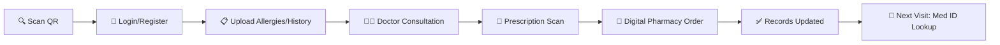

# <div align="center">MedHive</div>

<div align="center">
<strong>Your Health, Unified. AI-Powered Healthcare Platform for Sri Lanka</strong>
</div>

<br />

<div align="center">


<br />

<a href="https://medhive.theoneatom.com">

</a>

<br />
<br />

**[Visit Live Site: https://medhive.theoneatom.com](https://medhive.theoneatom.com)**

</div>

<br />

> **"Breaking down clinic walls for continuous, safe, and informed care."**
>
> MedHive isn't just another health app—it's a movement toward unified healthcare.  
> Powered by AI and designed with modern glassmorphism aesthetics, it transforms fragmented medical records into a seamless, connected health experience using a single **Med ID**.

---

## 🌟 Vision

MedHive's mission is to:

- **Unify healthcare records** — One Med ID connects all your medical history across clinics
- **Digitize prescriptions** — AI-powered OCR eliminates illegible handwritten prescriptions
- **Empower patients & doctors** — Instant access to complete health timelines for better care
- **Transform Sri Lankan healthcare** — Modern, tech-driven solutions for local challenges

---

## 🏥 The Healthcare Crisis We're Solving

Traditional healthcare in Sri Lanka faces critical challenges:

| Challenge | Impact |
|-----------|--------|
| **Illegible Prescriptions** | Handwritten prescriptions cause confusion and medication errors |
| **Lost Health Records** | Patient history scattered across providers with no central system |
| **Pharmacy Errors** | Manual data entry leads to dispensing mistakes and patient harm |
| **No Data Insights** | Clinics and pharmacies lack analytics for better decision-making |
| **Blind Medicine Imports** | Pharma companies import without understanding real market demand |
| **Fragmented Care** | Patients struggle to coordinate care across multiple providers |

---

## 🎨 Premium Dark Glass Design

<div align="center">


</div>

- **Dark Mode First**  
  Pure black backgrounds (`#000000`) with subtle gradients for depth and elegance.

- **Glassmorphism Effects**  
  Frosted glass cards with `backdrop-filter: blur()` create premium layered interfaces.

- **Golden Accent System**  
  Warm gold (`#dca349`) provides visual hierarchy and brand recognition.

- **System Typography**  
  Native `-apple-system` font stack for maximum legibility and native feel.

- **Smooth Micro-Animations**  
  Fade-ins, slide-ups, and hover transitions for polished user experience.

---

## 🤖 AI-Powered Intelligence

- **Prescription OCR**  
  Instantly digitize handwritten prescriptions with advanced AI text recognition.

- **Lab Report Analyzer**  
  Automatically extract and track blood work and diagnostic test results over time.

- **Smart Data Extraction**  
  AI extracts medicine names, dosages, and schedules from photos instantly.

- **Clinical Insights**  
  Doctors access allergies, past intake, and notes via Med ID for personalized care.

---

## ✨ The MedHive Ecosystem

### For Patients
✅ **Med ID** — Single identifier for all your health records  
✅ **Complete Health Timeline** — Access your entire medical history instantly  
✅ **Medicine Reminders** — Never miss a dose with smart scheduling  
✅ **QR Code Access** — Scan at doctor's table to sync your records  
✅ **Privacy First** — Grant access only when you choose  

### For Clinics & Doctors
✅ **Patient Lookup** — Instant access to complete clinical history  
✅ **Digital Prescriptions** — No more illegible handwriting  
✅ **Pharmacy Integration** — Send prescriptions directly to in-house pharmacy  
✅ **Real-Time Analytics** — Insights on patient trends and patterns  
✅ **Clinical Notes** — Auto-saved to patient's MedHive account  

### For Pharmacies
✅ **Digital Orders** — Receive prescriptions electronically  
✅ **Error Reduction** — No manual transcription from paper scripts  
✅ **Inventory Insights** — Data-driven stock management  

### For Pharma Companies
✅ **Market Intelligence** — Data-driven demand forecasting  
✅ **Prescribing Patterns** — Understand real-world medication usage  
✅ **Import Optimization** — Make informed import decisions  

---

## 🔄 MedHive Patient Journey



### Step-by-Step Flow

| Step | Action | Result |
|------|--------|--------|
| **1. First Visit** | Patient scans QR code at doctor's table | Access MedHive web app, grant record access |
| **2. Digitization** | Handwritten prescription is scanned | AI extracts details, order sent to pharmacy |
| **3. Next Visit** | Patient provides Med ID | Doctor sees complete history, allergies, past intake |
| **4. Seamless Update** | Pharmacy dispenses order | New prescription & notes saved automatically |

---

## 📁 Project Structure

```
MedHive-Landing/
├── public/
│   ├── logode.png            # MedHive logo
│   └── logo.jpeg             # Alternative logo
├── src/
│   ├── App.jsx               # Main application component
│   ├── App.css               # Complete styling (glassmorphism design)
│   ├── main.jsx              # React entry point
│   └── index.css             # Base styles
├── index.html                # HTML entry point
├── package.json              # Dependencies & scripts
├── vite.config.js            # Vite configuration
└── README.md                 # This file
```

---

## 🚀 Quick Start

### Prerequisites

- **Node.js** (v18+)
- **npm** or **yarn**

### 1. Clone the Repository

```bash
git clone https://github.com/zakisheriff/MedHive-Landing.git
cd MedHive-Landing
```

### 2. Install Dependencies

```bash
npm install
```

### 3. Start Development Server

```bash
npm run dev
```

Visit **http://localhost:5173** 🎉

### 4. Build for Production

```bash
npm run build
```

The production-ready files will be in the `dist` folder.

---

## 🔧 Tech Stack

| Layer | Technology | Purpose |
|-------|------------|---------|
| **UI Framework** | React 19.2 | Modern component-based architecture |
| **Build Tool** | Vite 7.2 | Lightning-fast development & builds |
| **Styling** | Pure CSS | No frameworks, premium custom design |
| **Design System** | Glassmorphism | Frosted glass effects, dark theme |
| **Linting** | ESLint 9 | Code quality & consistency |

---

## 🎯 Key Features

### Landing Page Sections

| Section | Description |
|---------|-------------|
| **Hero** | Animated gradient background with glass card CTA |
| **Problems** | 6 healthcare challenges with icon cards |
| **Solutions** | 8 ecosystem solutions with gradient icons |
| **Features** | 6 key platform features |
| **Patient Journey** | 4-step onboarding flow |
| **CTA** | Early access signup |
| **Footer** | Contact, social links, legal |

### Design Tokens

```css
/* Primary Colors */
--accent-gold: #dca349;
--accent-gold-dark: #b8873d;
--bg-primary: #000000;
--bg-secondary: #1a1a1a;

/* Glass Effects */
--glass-bg: rgba(255, 255, 255, 0.05);
--glass-border: rgba(255, 255, 255, 0.1);
--glass-blur: blur(10px);

/* Text Colors */
--text-primary: #ffffff;
--text-secondary: rgba(255, 255, 255, 0.85);
--text-muted: rgba(255, 255, 255, 0.7);
```

---

## 📱 Responsive Design

- **Desktop** (900px+) — Full navigation with hover effects
- **Mobile** (≤900px) — Logo toggles modal menu, touch-optimized

### Mobile Features
- Modal-style navigation menu
- Tap-to-close overlay
- Active/press states for touch feedback
- Responsive grid layouts

---

## 🌐 Deployment

### Vercel (Recommended)

```bash
npm run build
# Deploy dist folder to Vercel
```

### Netlify

```bash
npm run build
# Deploy dist folder to Netlify
```

### Railway

Connect your GitHub repo and set:
- Build command: `npm run build`
- Publish directory: `dist`

---

## 🤝 Contributing

Contributions are welcome! Please feel free to submit a Pull Request.

1. Fork the repository
2. Create your feature branch (`git checkout -b feature/AmazingFeature`)
3. Commit your changes (`git commit -m 'Add some AmazingFeature'`)
4. Push to the branch (`git push origin feature/AmazingFeature`)
5. Open a Pull Request

---

## 📄 License

MIT License — Free and Open Source

---

## 📬 Contact

<div align="center">

[](mailto:reachmedhive@gmail.com)
[](https://www.linkedin.com/company/medhivelk)
[](https://www.instagram.com/medhive.lk)

</div>

---

<p align="center">
Made with ❤️ by the <strong>MedHive Team</strong>
</p>

<p align="center">
<em>Because healthcare should be unified for everyone.</em>
</p>
